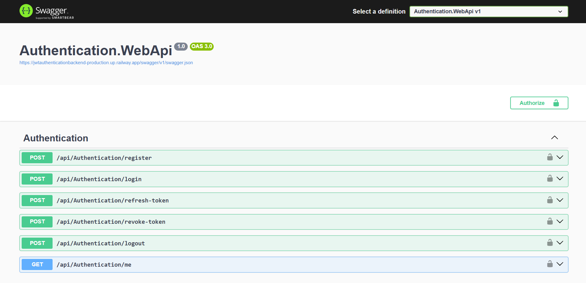
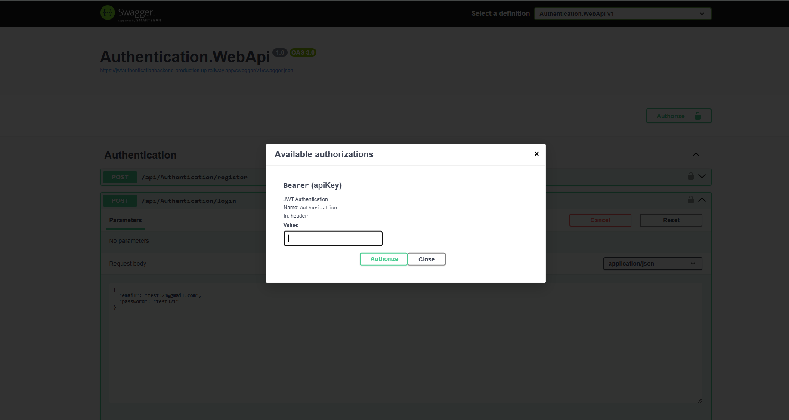
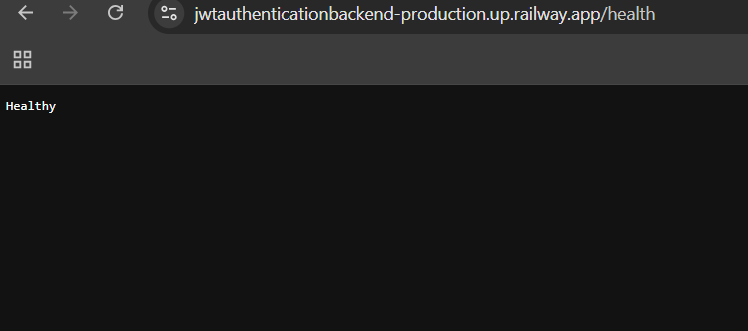
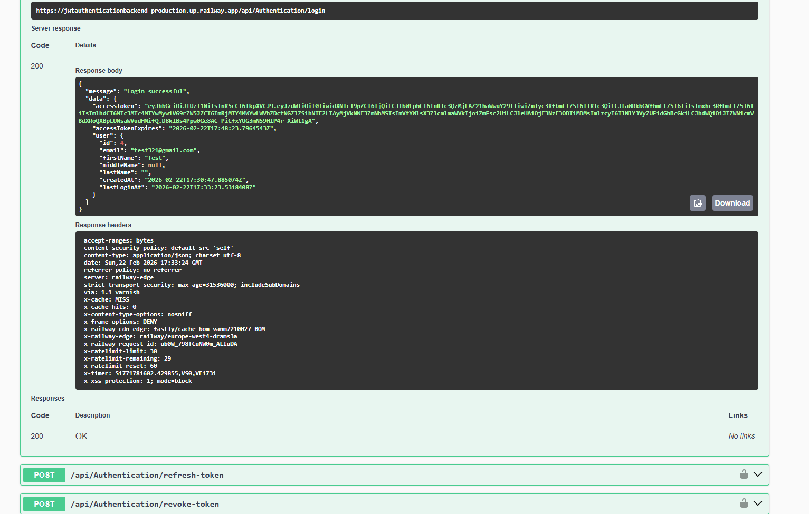
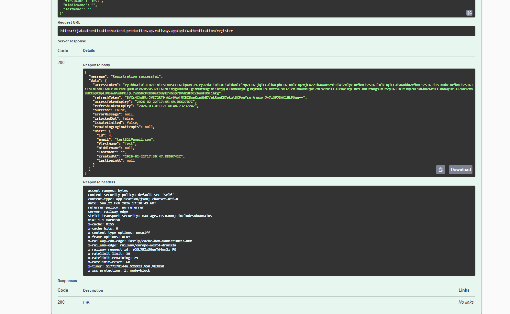
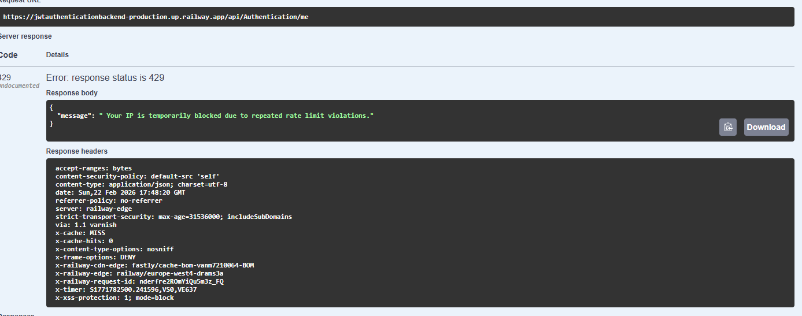
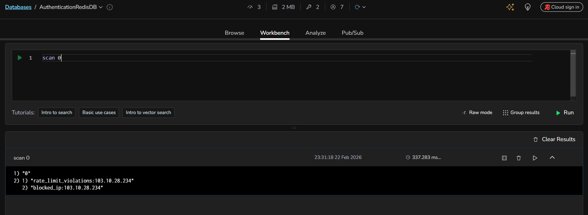
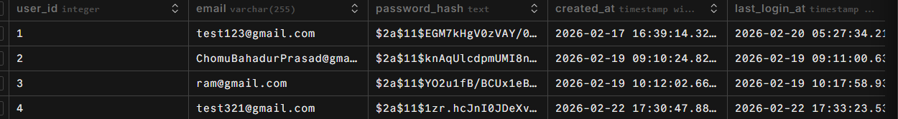

<h1 align="center" id="title">JWT Authentication Backend API (.NET 8 + PostgreSQL + Redis)</h1>

A production-ready .NET 8 Web API implementing secure JWT authentication with short-lived access tokens, HTTP-only refresh tokens, Redis-based rate limiting, IP-based login protection, Serilog logging, PostgreSQL integration, and Railway deployment.The backend follows clean architecture principles using the Repository Pattern with separate class libraries for API, Business Logic, and Data Access layers, ensuring maintainability, scalability, and real-world best practices.

<h2>🚀 Demo</h2>

**Base URL :**  
https://jwtauthenticationbackend-production.up.railway.app  

**Swagger Documentation :**  
https://jwtauthenticationbackend-production.up.railway.app/swagger

**Health Check Endpoint :**  
https://jwtauthenticationbackend-production.up.railway.app/health

  
  
<h2>🧐 Features</h2>

Here're some of the project's best features:

*   This JWT Authentication API implements secure JWT-based authentication using short-lived access tokens, HTTP-only refresh tokens, protected endpoints and secure logout functionality.
*   Security is maintained through BCrypt password hashing, Redis-based per-endpoint rate limiting, IP-based request tracking, brute-force login protection, maximum login attempt restrictions and temporary IP blocking.
*   Monitoring is enabled using Serilog structured logging including error tracking authentication, event logs, rate-limit violation logs and a dedicated /health endpoint for service status checks.
*   The application is deployed on Railway with production-ready configuration and environment-based secret management for secure and scalable operation.

<h2>💻 Built with</h2>

Technologies used in the project:

*   .NET 8 Web API
*   PostgreSQL
*   Redis
*   JWT (JSON Web Tokens)
*   BCrypt.Net
*   Serilog
*   Swagger (Swashbuckle)
*   Railway Platform (Deployment)

  <h2>Project Screenshots:</h2>

  ### Swagger API Testing 
   
  
  

  ### Health Monitoring
   

  ###  Login Response
   

  ###  Register Response
   

  ###  Rate Limit Violation
   

  ###  Redis Insight Screenshots
   

   ### Database Screenshots
   
